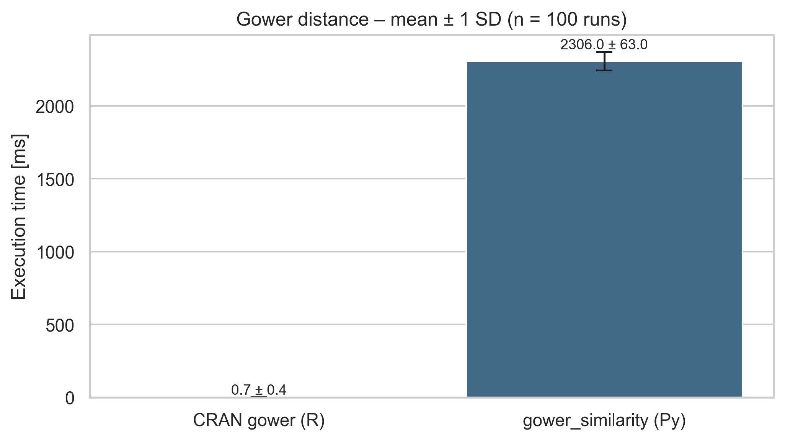
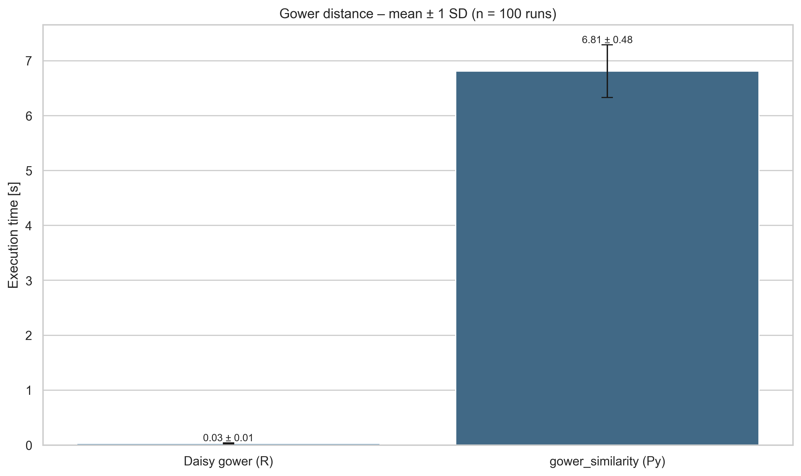

# Description
In this section, we will provide quick comparisons of our Python approach compared to R environment. For time writing this section (2025-06),
only two R libraries are available:
- [gower](https://github.com/markvanderloo/gower)
- [daisy module](https://www.rdocumentation.org/packages/cluster/versions/2.1.8.1/topics/daisy)

Used data can be found in `comparison/data` directory. Please keep in mind that following packages are mostly based on [original Gower's algorithm from 1971](https://www.jstor.org/stable/2528823) without additional features mentioned in [paper from 2021](https://arxiv.org/abs/2101.02481). Used scripts can be found in `comparison/scripts/` directory.

## CRAN gower
Part of [CRAN project](https://cran.r-project.org/web/packages/gower/index.html), based on C language using openMP for parallelization. Detailed step-by-step guide can be found [here](https://cran.r-project.org/web/packages/gower/vignettes/intro.pdf). It is worth to mention that CRAN gower returns distance which corresponds to `1 - similarity`.

We made comparison on two subsets created from `iris.csv` file. First contains rows 0-9, second 5-14. Then we compare then accordingly, row 0 with row 5, row 1 with row 6, etc. The result is list with 10 elements. 

| row | CRAN gower |   Pythoh   |
|:---:|:----------:|:----------:|
| 0   | 0.34606061 | 0.34606061 |
| 1   | 0.17939394 | 0.17939394 |
| 2   | 0.14303030 | 0.14303030 |
| 3   | 0.09636364 | 0.09636364 |
| 4   | 0.20424242 | 0.20424242 |
| 5   | 0.23636364 | 0.23636364 |
| 6   | 0.16000000 | 0.16000000 |
| 7   | 0.19939394 | 0.19939394 |
| 8   | 0.19818182 | 0.19818182 |
| 9   | 0.45030303 | 0.45030303 |

Every row contains 4 numeric and 1 categorical data type. Overall range is calculated on both sets, combined. Scale method is set to `range`. In original algorithm, missing data are not mentioned, thus authors skip them. They are not present in our data.

## Daisy gower
| row | Daisy Gower (6) | Daisy Gower (7) | Python (6)      | Python (7)      |
|:---:|:---------------:|:---------------:|:---------------:|:---------------:|
| 1   | 0.07683616      | 0.04444444      | 0.07683616      | 0.04444444      |
| 2   | 0.12961394      | 0.05833333      | 0.12961394      | 0.05833333      |
| 3   | 0.12744821      | 0.03394539      | 0.12744821      | 0.03394539      |
| 4   | 0.13455744      | 0.03672316      | 0.13455744      | 0.03672316      |
| 5   | 0.07405838      | 0.04722222      | 0.07405838      | 0.04722222      |
| 6   | 0.00000000      | 0.10461394      | 0.00000000      | 0.10461394      |
| 7   | 0.10461394      | 0.00000000      | 0.10461394      | 0.00000000      |
| 8   | 0.08733522      | 0.03394539      | 0.08733522      | 0.03394539      |
| 9   | 0.16572505      | 0.06111111      | 0.16572505      | 0.06111111      |
| 10  | 0.12622411      | 0.06172316      | 0.12622411      | 0.06172316      |

In example above, we compare the same dataset using daisy module from R and our Python implementation. Please be aware, that rows ids in R are 1-based compared to 0-based Python. Results are different due to calculating range scaling on all data not only first 20 rows. 

## Speed
Here we compare speed between our Python and R implementation. All calculation are made on `comparison/data/adult_reduced.csv` file, for 100 times. 

### CRAN gower
Firstly, we consider cran gower based on openMP C implementation. We compare first row with second, second with third, etc. Results below.

### Daisy gower
In contrary, using daisy module we can compare all rows with each other, which creates a matrix of distance. In our case, we reduced used data to 1000 rows, due to pure Python optimization (for now). Results below.

For now, there is no feature to calculate whole matrix automatically, you have to do it manually. We will add this feature in the future. For now, we boosted performance by using [Joblib](https://joblib.readthedocs.io/en/latest/index.html) framework.

## Weights and handling NaN values

In addition to the above comparisons, we also tested how our Python implementation handles weights and NaN values compared to the daisy module in R. Both scripts can be found in the `comparison/scripts/daisy/weights` and `comparison/scripts/daisy/nan_values` directories.