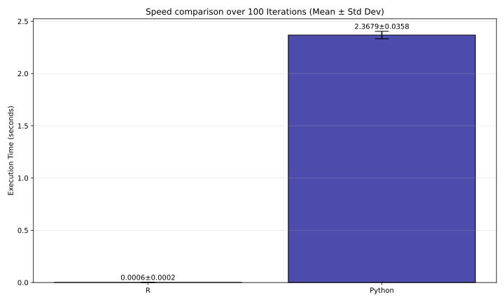

=============
Cran Module
=============

We used iris data.

----------------------------
Numerical Comparison (Cran)
----------------------------

+-----+------------+------------+
| row |     R      |   Python   |
+=====+============+============+
|  0  | 0.34606061 | 0.34606061 |
+-----+------------+------------+
|  1  | 0.17939394 | 0.17939394 |
+-----+------------+------------+
|  2  | 0.14303030 | 0.14303030 |
+-----+------------+------------+
|  3  | 0.09636364 | 0.09636364 |
+-----+------------+------------+
|  4  | 0.20424242 | 0.20424242 |
+-----+------------+------------+
|  5  | 0.23636364 | 0.23636364 |
+-----+------------+------------+
|  6  | 0.16000000 | 0.16000000 |
+-----+------------+------------+
|  7  | 0.19939394 | 0.19939394 |
+-----+------------+------------+
|  8  | 0.19818182 | 0.19818182 |
+-----+------------+------------+
|  9  | 0.45030303 | 0.45030303 |
+-----+------------+------------+

------------------------
Speed Comparison (Cran)
------------------------

------------------------
More information (Cran)
------------------------

For more detailed description, please refer to `this <https://github.com/mwardynski/gower-metric/blob/refactor_newapi/comparison/README.md>`_ file.
