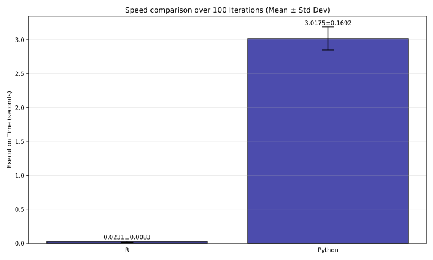

=============
Daisy Module
=============

We used iris data.

---------------------------
Daisy Numerical Comparison
---------------------------

Python
------

.. list-table::
   :header-rows: 1
   :stub-columns: 1

   * - 
     - **1**
     - **2**
     - **3**
     - **4**
     - **5**
     - **6**
     - **7**
     - **8**
     - **9**
     - **10**
   * - **1**
     - 0.076836
     - 0.044444
     - 0.017279
     - 0.088889
     - 0.056168
     - 0.036723
     - 0.031780
     - 0.066667
     - 0.104614
     - 0.087335
   * - **2**
     - 0.129614
     - 0.058333
     - 0.042279
     - 0.036111
     - 0.020056
     - 0.089501
     - 0.045669
     - 0.013889
     - 0.051836
     - 0.140113
   * - **3**
     - 0.127448
     - 0.033945
     - 0.040113
     - 0.045056
     - 0.034557
     - 0.087335
     - 0.032392
     - 0.033945
     - 0.054002
     - 0.131168
   * - **4**
     - 0.134557
     - 0.036723
     - 0.047222
     - 0.031168
     - 0.025000
     - 0.094444
     - 0.039501
     - 0.031168
     - 0.046893
     - 0.151836
   * - **5**
     - 0.074058
     - 0.047222
     - 0.020056
     - 0.091667
     - 0.058945
     - 0.033945
     - 0.034557
     - 0.069444
     - 0.107392
     - 0.084557
   * - **6**
     - 0.000000
     - 0.104614
     - 0.087335
     - 0.165725
     - 0.126224
     - 0.040113
     - 0.095056
     - 0.143503
     - 0.181450
     - 0.064171
   * - **7**
     - 0.104614
     - 0.000000
     - 0.033945
     - 0.061111
     - 0.061723
     - 0.081168
     - 0.026224
     - 0.061111
     - 0.076836
     - 0.131780
   * - **8**
     - 0.087335
     - 0.033945
     - 0.000000
     - 0.078390
     - 0.038889
     - 0.047222
     - 0.014501
     - 0.056168
     - 0.094115
     - 0.104614
   * - **9**
     - 0.165725
     - 0.061111
     - 0.078390
     - 0.000000
     - 0.056168
     - 0.125612
     - 0.070669
     - 0.038889
     - 0.032392
     - 0.176224
   * - **10**
     - 0.126224
     - 0.061723
     - 0.038889
     - 0.056168
     - 0.000000
     - 0.086111
     - 0.042279
     - 0.017279
     - 0.055226
     - 0.143503

R
-

.. list-table::
   :header-rows: 1
   :stub-columns: 1

   * - 
     - **1**
     - **2**
     - **3**
     - **4**
     - **5**
     - **6**
     - **7**
     - **8**
     - **9**
     - **10**
   * - **1**
     - 0.076836
     - 0.044444
     - 0.017279
     - 0.088889
     - 0.056168
     - 0.036723
     - 0.031780
     - 0.066667
     - 0.104614
     - 0.087335
   * - **2**
     - 0.129614
     - 0.058333
     - 0.042279
     - 0.036111
     - 0.020056
     - 0.089501
     - 0.045669
     - 0.013889
     - 0.051836
     - 0.140113
   * - **3**
     - 0.127448
     - 0.033945
     - 0.040113
     - 0.045056
     - 0.034557
     - 0.087335
     - 0.032392
     - 0.033945
     - 0.054002
     - 0.131168
   * - **4**
     - 0.134557
     - 0.036723
     - 0.047222
     - 0.031168
     - 0.025000
     - 0.094444
     - 0.039501
     - 0.031168
     - 0.046893
     - 0.151836
   * - **5**
     - 0.074058
     - 0.047222
     - 0.020056
     - 0.091667
     - 0.058945
     - 0.033945
     - 0.034557
     - 0.069444
     - 0.107392
     - 0.084557
   * - **6**
     - 0.000000
     - 0.104614
     - 0.087335
     - 0.165725
     - 0.126224
     - 0.040113
     - 0.095056
     - 0.143503
     - 0.181450
     - 0.064171
   * - **7**
     - 0.104614
     - 0.000000
     - 0.033945
     - 0.061111
     - 0.061723
     - 0.081168
     - 0.026224
     - 0.061111
     - 0.076836
     - 0.131780
   * - **8**
     - 0.087335
     - 0.033945
     - 0.000000
     - 0.078390
     - 0.038889
     - 0.047222
     - 0.014501
     - 0.056168
     - 0.094115
     - 0.104614
   * - **9**
     - 0.165725
     - 0.061111
     - 0.078390
     - 0.000000
     - 0.056168
     - 0.125612
     - 0.070669
     - 0.038889
     - 0.032392
     - 0.176224
   * - **10**
     - 0.126224
     - 0.061723
     - 0.038889
     - 0.056168
     - 0.000000
     - 0.086111
     - 0.042279
     - 0.017279
     - 0.055226
     - 0.143503

-----------------------
Daisy Speed Comparison
-----------------------

-----------------------
Daisy More information
-----------------------

For more detailed description, please refer to `this <https://github.com/mwardynski/gower-metric/blob/refactor_newapi/comparison/README.md>`_ file.